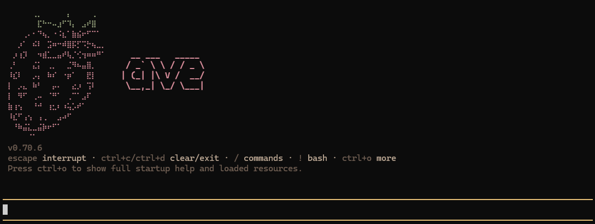

## ave

Fork of [pi](https://github.com/badlogic/pi-mono/tree/main) with [dirac](https://github.com/dirac-run/dirac/) optimization's:

- Hash-Anchored Edits.
- Multi-File Batching.

These reduce token costs and improve speed while maintaining quality.

## Installation

```sh
npm install -g @ichigo.moe/ave
```

## Development

```bash
npm install          # Install all dependencies
npm run build        # Build all packages
npm run check        # Lint, format, and type check
./test.sh            # Run tests (skips LLM-dependent tests without API keys)
./pi-test.sh         # Run pi from sources (can be run from any directory)
```

> **Note:** `npm run check` requires `npm run build` to be run first. The web-ui package uses `tsc` which needs compiled `.d.ts` files from dependencies.

## License

MIT
